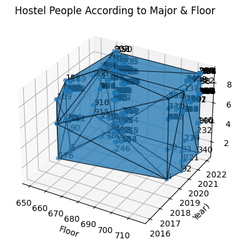

**Election Results Data Analysis**
================================
**Output Screenshot**
--------------------

This screenshot shows an interactive visualization of election results, with constituencies colored by winning party and sized by vote share. The visualization allows users to hover over each constituency to view detailed information on candidate demographics and vote shares.

**Getting Started**
-------------------

To replicate this analysis, simply download the dataset and Jupyter Notebook, and run the code in the Notebook. The output report and visualization will be generated automatically.